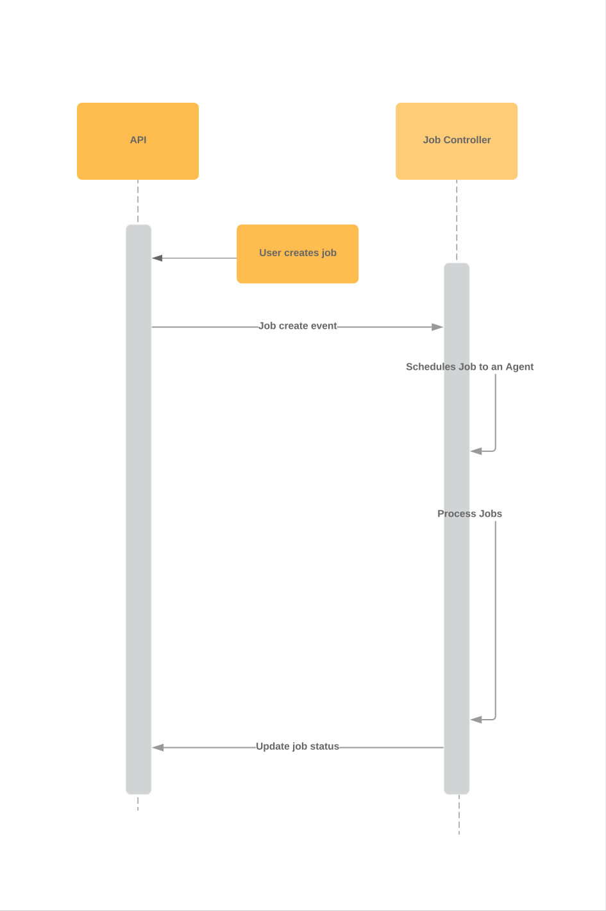

# kubebuilder-demo

[](https://travis-ci.org/saravanakumar-periyasamy/kubebuilder-demo) [](https://codecov.io/gh/saravanakumar-periyasamy/kubebuilder-demo)

Demo project to create Job CRD, and gets scheduled on Agents to get processed.

* Defines Job CRD
* Schedules the Jobs to one of the agents randomly `agent1, agent2, agent3`
* Process the jobs & updates the status `Succeeded, Failed, Pending`

###### Sample Job

```
apiVersion: batch.crossplane.io/v1alpha1
kind: Job
metadata:
  name: job-c
  namespace: default
spec:
  agent: agent1
  result: 18
status:
  state: Succeeded
```




## Install

#### Prerequisites

* `kubectl`
* `kustomize`
* `kubernetes cluster`

#### Install steps 

* clone the repo
* run the below commands. 
```
kubectl apply -f config/crds
kustomize build config/default | kubectl apply -f -
```

## Test

* Create the sample jobs
```
kubectl apply -f config/samples/batch_v1alpha1_job.yaml
```
* List the jobs created 
```
kubectl get jobs.batch.crossplane.io
```
* Describe the job to see the result, status & events
```
kubectl describe jobs.batch.crossplane.io job-b
```

```
Name:         job-b
Namespace:    default
Labels:       controller-tools.k8s.io=1.0
Annotations:  kubectl.kubernetes.io/last-applied-configuration:
                {"apiVersion":"batch.crossplane.io/v1alpha1","kind":"Job","metadata":{"annotations":{},"labels":{"controller-tools.k8s.io":"1.0"},"name":"...
API Version:  batch.crossplane.io/v1alpha1
Kind:         Job
Metadata:
  Creation Timestamp:  2019-04-01T21:35:46Z
  Generation:          4
  Resource Version:    1141
  Self Link:           /apis/batch.crossplane.io/v1alpha1/namespaces/default/jobs/job-b
  UID:                 1c76282b-54c6-11e9-bfd0-025000000001
Spec:
  Agent:  agent3
  Depend On Jobs:
    job-c
  Result:  40
Status:
  State:  Succeeded
Events:
  Type     Reason     Age    From            Message
  ----     ------     ----   ----            -------
  Normal   Pending    5m     job-controller  Job Pending
  Warning  Pending    4m49s  job-controller  Dependent Job is not succeeded, job:job-c
  Normal   Succeeded  4m39s  job-controller  Job Succeeded, result:40
```

* To watch the controller logs
```
kubectl logs -f kubebuilder-demo-controller-manager-0 -n kubebuilder-demo-system -c manager
```

